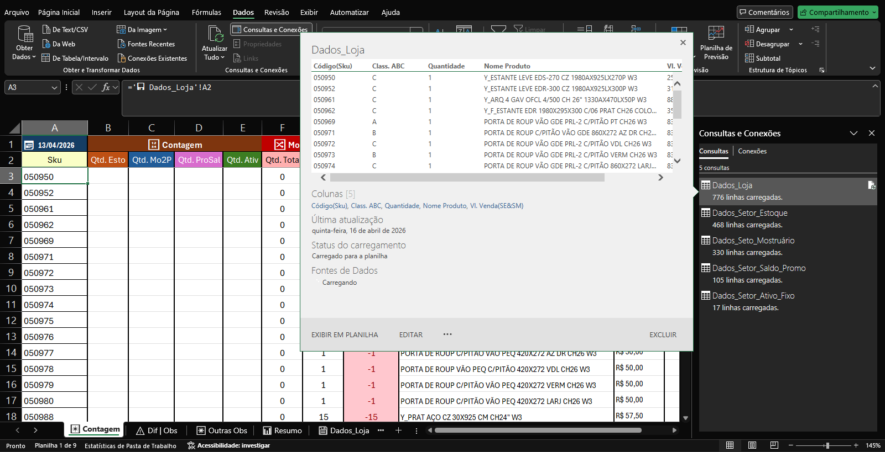
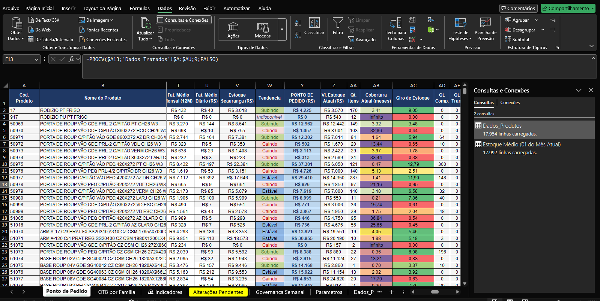
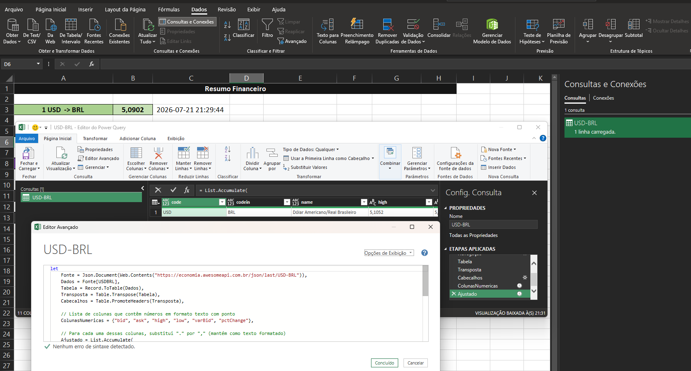
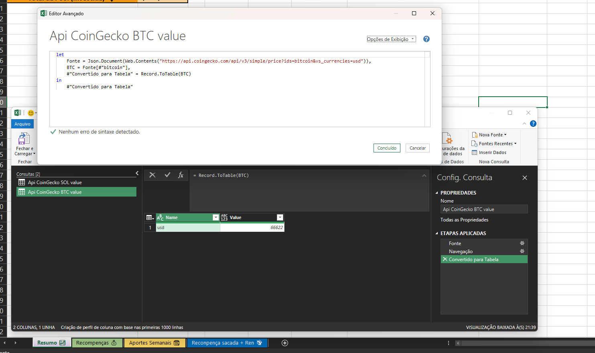
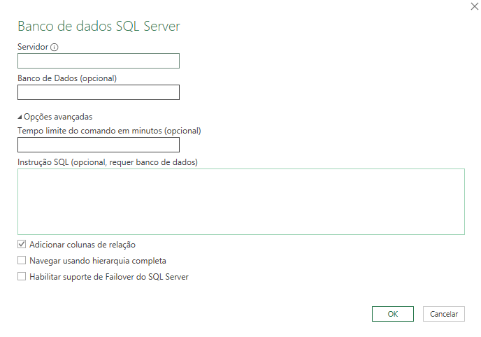

# Fontes de dados no Excel 
Um dos softwares mais utilizados no mercado está sendo constantemente subutilizado pelos seus usuários. Sim, estou falando o famoso software de planilhas Excel. A verdade é que a rotina maçante e manual acaba impedindo a exploração de recursos estratégicos do software.

Fórmulas, tabelas dinâmicas, gráficos, filtros e formatação são conceitos já considerados básicos para quem utilizada diariamente o excel. Mas todos esses recursos são subsequentes da etapa mais importante para quem usa o software, que é a importação dos dados. Alguns vão colocando os dados manualmente, outros já utilizam com maestria o "Copiar e Colar", outros só puxam de outra planilha com fórmulas. 

Mas a verdade é que dados são dinâmicos e precisam ser atualizados constantemente para retratar a realidade. Desta forma, os métodos tradicionais de análise (via Excel) podem acabar ficando trabalhosos e demandar tempo e pessoal para a construção. É ai que entra a **`funcionalidade de dados no excel (Power Query)`**. Acessando em **Dados > Obter dados** é possível ver as opções de conexão com as fontes externas e internas de dados [imagem de exemplo abaixo]. 

*A interface pode mudar dependendo da versão do Microsoft Office (Microsoft 365).

Cada vez mais as informações passam por sistemas e bancos de dados, ou seja, existe grande possibilidade de que alguma opção da aba de dados já pode ser aplicada no dia a dia. Agora a questão recai no conhecimento técnico disponível para a configuração. Uma assistente pessoal (IA) ou um técnico de informática (caso seja necessário credenciais de acesso também) podem ajudar na parte técnica.  

> 💡 A própria microsoft disponibiliza um manual simples de importação de dados para cada fonte: 🔗[Importar dados de origens de dados (Power Query)](https://support.microsoft.com/pt-BR/Excel/import-data-from-data-sources-power-query)

Aqui vou destacar duas fontes de dados fenomenais que vão abrir várias possibilidades de importação de dados.

- `Bancos de dados`: Todo sistema, seja ele online ou local, possui um lugar onde os dados são armazenados, e esses banco de dados podem ser acessados diretamente com certas credenciais. Com **conhecimento em Sql** (ou similar) é possível minerar e modelar um grande número de dados.

- `API's (Da Web)`: Informações prontas para serem consumidas da internet. Não são tão flexíveis como os bancos de dados mas podem passar dados pontuais instantâneos e atualizados. 

## ✨ Motivação.
A melhoria gerada na implementação de planilhas automatizadas para os colaborardes (que já usam o excel de forma cotidiana) da empresa é perceptível e significante. Quase 0 adaptação (o software não é novo) e agilidade nas análises.  

Dados de vendas, compras e estoque em tempo real ao apertar um simples botão. Antes de implementar soluções complexas e que demandem tempo e treinamento em um novo software é válido testar o trabalho via excel (principalmente quando já é padrão na empresa e o caixa já está apertado).

## 🍞 Mãos na massa (exemplos)

Algumas das planilhas feitas nos meus trabalhos e uso pessoal para ilustrar as possibilidades.

### Planilhas de auditoria

Usando a conexão com banco de dados (Sql server) e sabendo trabalhar com Sql foi possível pegar informações instantâneas do estoque das lojas e deixar atualizado e pronto para a contagem via tablet (google sheets).

### Controle de Estoque e Compras
Além dos dados de estoque foram trazidos dados de venda. Assim, possibilitando previsões de reposição , giro e outros dados.

### Dados de clientes e Fluxos financeiros

Campanhas de marketing precisam de um base completa de clientes para compor a listagem de envio. Usando sql e a conexão com o banco foi possível gerar uma planilha com todos os clientes (com telefone e email). Devido a flexibilidade do Sql Também foi possível pegar dados mais específicos como a data de ultima compra, valor total do faturamento do cliente, ticket médio e outros. Um vez já pronta, agora só é necessário atualizar para pegar a base novamente com dados mais recentes. 

Fluxo de baixa com contas a pagar no dia e contas já pagas. Fácil visualização do quanto que falta para pagar no dia e no decorrer do mês e conforme as contas vão sendo dadas como quitadas no sistema\ERP os valores vão diminuindo na planilha depois de atualizada (sem retrabalho com adição manual).

[Imagens indisponíveis por conter conteúdo sensível]

### Controle financeiro e de investimentos (pessoal)

Quem nunca usou planilhas para controlar os gastos e investimentos ? a diferença é que dessa vez utilizei API's para pegar cotações de valor de ativos de mercado (EX: Coingecko e TradeView) no meu portfólio de investimentos. Ou seja, dá para dizer exatamente o valor dos meus ativos no mercado atual sem precisar ficar calculando toda hora. 

>⬇️ [baixa aqui ](assets/xls/exemplo.xlsx) um arquivo de exemplo com api's públicas. Bancos de dados públicos são mais difíceis de acessar, sugiro instalar um banco local com um exemplo (como [AdventureWorks](https://learn.microsoft.com/pt-br/sql/samples/adventureworks-install-configure?view=sql-server-ver17&tabs=ssms)) ou usar um serviço online (como [Azure](https://azure.microsoft.com/en-us/products/azure-sql/database/https://azure.microsoft.com/en-us/products/azure-sql/database/), [Aws](https://aws.amazon.com/) ou [Oracle Cloud](https://www.oracle.com/cloud/)) para testar a conexão com banco de dados.

## ⚜ O Diferencial 
No geral, essas conexões fazem o excel uma plataforma mais voltada para análise do que somente de registro. Sim, o excel não é a melhor plataforma de análise porém é simples o suficiente para proporcionar soluções rápidas e de baixo custo (tanto em treinamento humano e capital). 

Para aqueles que possuem conhecimento na area de engenharia de dados (principalmente em Sql) essa ferramenta pode dar bastante agilidade na construção e compartilhamento de análises. 

Além das credencias necessárias para conexão, o campo mais importante na configuração é instrução sql que é passada pra a conexão. Usando consultas bem elaboradas e eficientes, a captura e atualização de dados fica extremamente eficiente e simples. 

> 💡 Assistentes de IA são bem úteis no processo de construção de scripts em sql ou similares (SQl server, MySQL, PostgresSql, Oracle...), basta ter o conhecimento das estruturas relacionais e do contexto do banco de dados para enriquecer o prompt de criação / edição.

Nada impede, também, de partir para outros softwares mais robustos (Como Power BI, Tableau e Looker) com a mesma consulta já criada para a visualização simples do excel.

